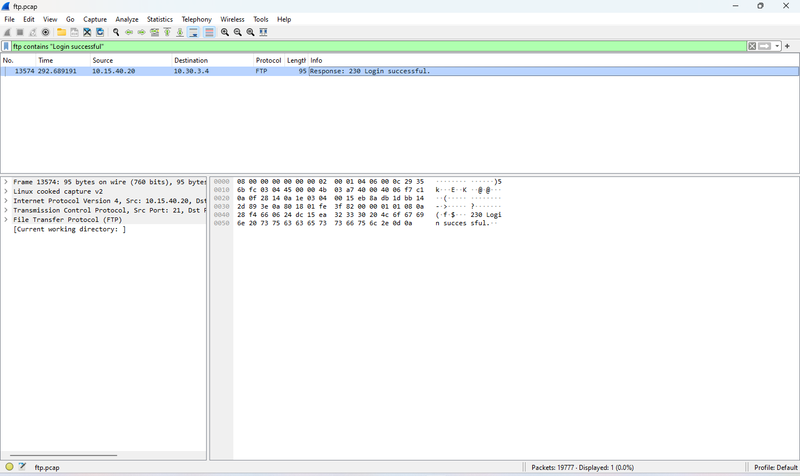
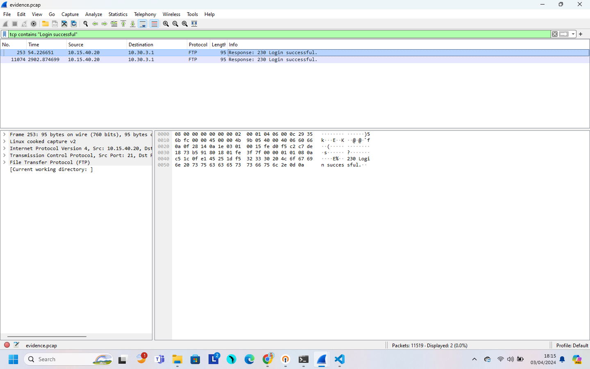
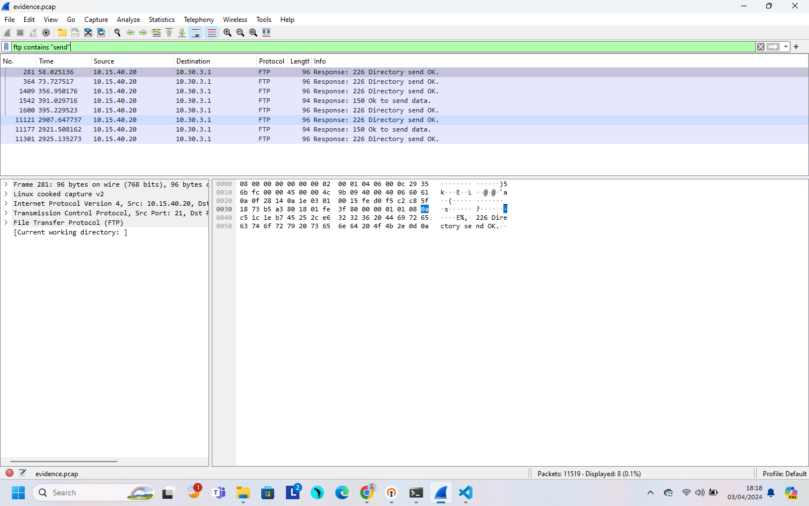

# Laporan-Resmi-Jarkom-Modul-1-IT25-2024

## Anggota

| Nama                                          | NRP          |
| --------------------------------------------- | ------------ |
| Mohammad Arkananta Radithya Taratugang        | `5027221003` |
| Michael Wayne                                 | `5027221037` |

## >> Evidence
1. Menggunakan filter `frame contains "Login Successful"` untuk melihat email dan password yang benar

2. Pada packet yang dibuka, terlihat informasi seperti host, server, dll. Didapatkan domain korban = `nanomate-solutions.com` dan web servernya adalah Apache/2.4.56


3. Pada stream yang sama, didapati tulisan method POST, pada sebelah kanan method POST tersebut bisa dilihat endpoint yang digunakan user untuk login adalah `/app/includes/process_login.php`

4. Terlihat juga email dan password yang benar, Email: `tareq@gmail.com`, password: `tareq@nanomate`

```
nc 10.15.40.20 10002
Jawab pertanyaan-pertanyaan yang telah disediakan:

No 1:
Pertanyaan: Apa domain milik korban?
Format: xxxxxx.xxx: e.g. google.com
Jawaban: nanomate-solutions.com
Correct

No 2:
Pertanyaan: Apa web server yang digunakan oleh korban?
Format: name-version: e.g. nginx-1.18.0
Jawaban: apache-2.4.56
Correct

No 3:
Pertanyaan: Apa endpoint yang digunakan untuk login sebagai user biasa?
Format: /path/to/endpoint
Jawaban: /app/includes/process_login.php
Correct

No 4:
Pertanyaan: Apa email dan password yang berhasil digunakan untuk login sebagai user biasa?
Format: email:password
Jawaban: tareq@gmail.com:tareq@nanomate
Correct

Congrats! Flag: JARKOM2024{m4innya_h3bat_xTCkXcptgRVeR8t}
```

## >> Trace Him
1. Cek conversation pada packet dengan Statistics -> Conversations
2. Terlihat bahwa pada protocol `TCP 320` terjadi banyak request/packet yang terkirim dari IP `10.30.3.4`, terlihat juga ada banyak request login yang menunjukkan bahwa itu IP attacker

3. Didapatkan IP attacker adalah `10.30.3.4`

```
nc 10.15.40.20 10006
Jawab pertanyaan-pertanyaan yang telah disediakan:

No 6:
Pertanyaan: Alamat IP attacker?
Format: xxx.xxx.xxx.xxx
Jawaban: 10.30.3.4
Correct

Congrats! Flag: JARKOM2024{Wh3re'5_thE_S4uce_uTwkYbxti6dHk89}
```

## >> Secret
1. Gunakan filter `ftp-data` untuk melihat data apa saja yang ada
2. Terlihat ada 2 file yaitu `m4L1c10us_W4re.c` dan `mirza.jpg`


3. Untuk dapat melihat isi data, mengunduh kedua file dengan File -> Export Objects -> FTP-DATA -> Save file yang dipilih


4. Didapatkan pesan rahasia attacker adalah `MIO MIRZA`


```
nc 10.15.40.20 10010
Jawab pertanyaan-pertanyaan yang telah disediakan:

No 10:
Pertanyaan: Ternyata attacker menyisipkan file lainnya selain dari file malware, temukan pesan yg dikutip oleh attacker?
Format: strings
Jawaban: MIO MIRZA
Correct

Congrats! Flag: JARKOM2024{l0_Blm_tW_MIO_MIRZA?_cTrkX7xjQzktCAB}
```
   
## >> Fuzz
1. Buka stream

2. Cek conversation pada packet dengan Statistics -> Conversations, terlihat pada protocol `TCP 85` terjadi banyak request yang terkirim dari IP `10.33.1.154`


3. Maka didapatkan IP attacker adalah `10.33.1.154`

4. Terlihat juga port dari attacker adalah `80`

5. Gunakan filter `http.request.method == POST`, didapatkan endpoint yang digunakan adalah `/`


6. Follow HTTP stream dari salah satu packet, pada bagian User-Agent terlihat tools yang digunakan adalah Fuzz Faster U Fool v2.0.0-dev


7. Berdasarkan stream yang sudah dibuka, kita bisa melihat bahwa banyak percobaan login yang gagal, untuk mencari mana yang berhasil maka bisa menggunakan filter `frame contains "302 Found"`


8. Follow TCP stream dari packet tersebut, lalu pada kolom Find, bisa dicari kata 302 Found


9. Didapatkan username: admin, dan password: sUp3rSecretp@ssw0rd

```
nc 10.15.40.20 10001
Jawab pertanyaan-pertanyaan yang telah disediakan:

No 1:
Pertanyaan: Apa IP address milik attacker?
Format: xxx.xxx.xxx.xxx
Jawaban: 10.33.1.154
Correct

No 2:
Pertanyaan: Apa port yang digunakan sebagai web server korban?
Format: xxxx: e.g. 22
Jawaban: 80
Correct

No 3:
Pertanyaan: Apa endpoint yang digunakan untuk login?
Format: /path/to/endpoint
Jawaban: /
Correct

No 4:
Pertanyaan: Apa tool yang digunakan oleh attacker untuk bruteforce login?
Format: toolsname-version: e.g. hydra-v9.0-dev
Jawaban: ffuf-v2.0.0-dev
Correct

No 5:
Pertanyaan: Apa username dan password yang berhasil digunakan oleh attacker?
Format: username:password
Jawaban: admin:sUp3rSecretp@ssw0rd
Correct

Congrats! Flag: JARKOM2024{s3m4ng4t_ya_<3_9hwkXzAHizdtk4t}
```

## >> ATM or ATP or FTP ?

Pada percobaan kali ini praktikan diminta untuk mengetahui password mana yang berhasil dibobol oleh hacker untuk melakukan serangan login.

1. Ketik ftp contains "Login successful" pada kolom filter


2. Tekan Enter
3. Muncul paket dengan status response Login successful, lalu klik kanan -> follow -> TCP stream


```
220 Welcome Alpine ftp server https://hub.docker.com/r/delfer/alpine-ftp-server/
USER adminJarkom
331 Please specify the password.
PASS m4y_th3_Kn!fe_ch1p_&_sh4tter
230 Login successful.
```

Telah didapatkan bahwa penyerang menggunakan password "m4y_th3_Kn!fe_ch1p_&_sh4tter" untuk melakukan proses login hingga berhasil

```
Jawab pertanyaan-pertanyaan yang telah disediakan:

No 4:
Pertanyaan: Apa password yang berhasil didapatkan oleh hacker setelah melakukan bruteforce login ftp?
Format: strings
Jawaban: m4y_th3_Kn!fe_ch1p_&_sh4tter
Correct

Congrats! Flag: JARKOM2024{Brut3f0rce_FtP_9hCRPc9jy6Fek8Y}
```

## >> How Many packets?

Pada percobaan kali ini praktikan diminta untuk mengetahui berapa kali hacker melakukan bruteforce.

1. Pada kolom filter ketik ftp.request.command == "PASS"


2. Setelah itu klik Statistics -> Capture File Properties untuk mengetahui nilai packets yang didapat. Tertulis bahwa sebanyak 934 kali hacker melakukan serangan bruteforce


3. Angka 934 dimasukkan ke dalam kolom jawaban dan flag tersebut didapatkan
```
Jawab pertanyaan-pertanyaan yang telah disediakan:

No 5:
Pertanyaan: Berapa total attempt login(bruteforce) yang dilakukan oleh hacker?
Format: number
Jawaban: 934
Correct

Congrats! Flag: JARKOM2024{c0unT_uR_P4cket5_xhCkY7xfl1VtR8Y}
```

## >> Creds

Percobaan kali ini praktikan diminta untuk mencari username dan password yang berhasil dibobol oleh hacker dari salah satu packets yang tersedia.

1. Ketik ftp contains "Login successful" pada kolom filter


2. Muncul paket dengan status response Login successful, lalu klik kanan -> follow -> TCP stream


3. Didapat bahwa username dan password tersebut berhasil melakukan login.


4. Oleh karena itu, jawaban tersebut dimasukkan oleh pratikan ke dalam pertanyaan berikut
```
Jawab pertanyaan-pertanyaan yang telah disediakan:

No 1:
Pertanyaan: Apa Username FTP yang digunakan oleh attacker?
Format: USER:username
Jawaban: USER:h3ngk3rTzy
Correct

No 2:
Pertanyaan: Apa Password FTP yang digunakan oleh attacker?
Format: PASS:password
Jawaban: PASS:S!l3ncE
Correct

Congrats! Flag: JARKOM2024{s3curE_uR_FtP_I6wRYbnyQ1koR89}
```

## >> Malwleowleo

Percobaan kali ini praktikan diminta untuk mencari file malware yang dikirim oleh hacker

1. Ketik ftp contains "send" pada kolom filter


2. Muncul paket dengan status response "Ok to send data", lalu klik kanan -> follow -> TCP stream

3. Terlihat bahwa terdapat 1 file bernama m4L1c10us_W4re.c


```
Jawab pertanyaan-pertanyaan yang telah disediakan:

No 8:
Pertanyaan: Apa nama malware yang dikirim oleh attacker ke korban?
Format: strings
Jawaban: m4L1c10us_W4re.c
Correct

Congrats! Flag: JARKOM2024{beC4refUl_0f_m4lwAr3_u6wkvbAHQ1JtR8q}
```

## >> whoami

Pada percobaan kali ini, praktikan diminta untuk mencari tahu siapa nama hacker tersebut.

1. Pada wireshark, klik File -> Export Objects -> FTP-DATA...
2. Terdapat 2 file, yaitu m4L1c10us_W4re.c dan mirza.jpg. Kita pilih file m4L1c10us_W4re.c untuk didownload
3. File yang dibuka akan tampil seperti ini

4. String tersebut kemudian didecode dan menghasilkan output "Hello my name is Paul Atreides". Oleh karena itu, Paul Atreides adalah nama dari hacker tersebut

```
Jawab pertanyaan-pertanyaan yang telah disediakan:

No 9:
Pertanyaan: Siapa nama attacker yang sudah melakukan serangan ini?
Format: FirstName_LastName
Jawaban: Paul_Atreides
Correct

Congrats! Flag: JARKOM2024{Duk3_0f_4rak!s_LISAN AL GHAIB!_ITwkRzxflRFH8rq}
```

## >> Malwaew
1. Karena ketika digunakan filter http, tidak ada packet yang muncul. Maka perlu dilakukan decrypt TLS untuk melihat seluruh komunikasi data yang ada.


2. Lakukan decrypt TLS dengan menggunakan keylog file yang telah diberikan. Decrypt TLS dapat dilakukan dengan Edit -> Preference


3 Pada Preferences, dapat dilihat pada bagian Protocol -> TLS, lalu kita dapat memasukkan `keylog.txt` yang telah diberikan pada (Pre)-Master-Secret log filename


4. Setelah itu, kita dapat menggunakan filter `http` untuk melihat  POST atau GET. Terdapat 1 file dengan ekstensi .dll yang dimana merupakan executable file dan bisa ditanami malware


5. Download dan buka file .dll tersebut


6. Soal meminta untuk mendapatkan SHA-256 hash dari malware yang dimaksud (invest_20.dll), maka perlu dilakukan decrypt SHA-256, disini saya menggunakan terminal kali dengan command
```
shasum -a 256 invest_20.dll
```


lalu submit pada netcat

```
nc 10.15.40.20 10003
Jawab pertanyaan-pertanyaan yang telah disediakan:

No 1:
Pertanyaan: Apa SHA-256 hash dari malware yang dimaksud?
Format: sha256 hash: e.g. c8cf761b68c5f693e5cf2d23acdcca1c0295c1f739805d60df46e54e37ada3da
Jawaban: 31cf42b2a7c5c558f44cfc67684cc344c17d4946d3a1e0b2cecb8eb58173cb2f
Correct

Congrats! Flag: JARKOM2024{wow_how_u_solve_this_I6CRP7pfi6dsRAq}
```


